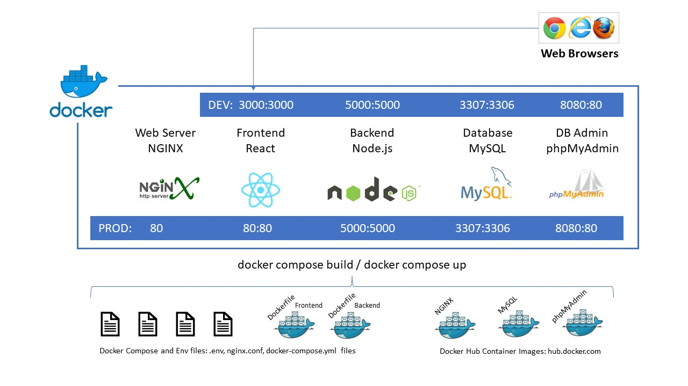

# React, Node.js and MySQL Docker

Docker Compose pipeline including React Frontend, Node.js Express API Backend, MySQL Database and phpMyAdmin interface for MySQL. This is a development environment with hot-reload of React and Express servers and a production environment with React using NGINX.



## Prerequisites

- Node.js installed
- Docker Desktop/Engine installed

## Cloning the repository

Clone the following repository on your computer.

```
git clone https://github.com/kurkehei/fullstack-react-nodejs-mysql-docker.git
```

## Running on Docker

Run the infrastructure using the `dev.sh` or `prod.sh` scripts. These scripts launch the `docker compose` commands using the suitable options.

### Development

| Script command | Actual docker compose command |
| --- | --- |
| `./dev.sh build`  | `docker compose --env-file .env.dev --file docker-compose.dev.yml build` |
| `./dev.sh start`  | `docker compose --env-file .env.dev --file docker-compose.dev.yml up -d` |
| `./dev.sh stop`   | `docker compose --env-file .env.dev --file docker-compose.dev.yml down`  |
| `./dev.sh clean`  | `docker system prune --force`  |
| `./dev.sh fclean` | `docker system prune --all --force`  |

### Production

| Script command | Actual docker compose command |
| --- | --- |
| `./prod.sh build`  | `docker compose --env-file .env.prod --file docker-compose.prod.yml build` |
| `./prod.sh start`  | `docker compose --env-file .env.prod --file docker-compose.prod.yml up -d` |
| `./prod.sh stop`   | `docker compose --env-file .env.prod --file docker-compose.prod.yml down`  |
| `./prod.sh clean`  | `docker system prune --force`  |
| `./prod.sh fclean` | `docker system prune --all --force`  |

## Conclusion

Let's dive in and test the application.

### Development

| URL-address | HOST Port | Docker Port | Description |
| --- | --- | --- | --- |
| `http://localhost:3000` | 3000 | 3000 | Frontend React App |
| `http://localhost:5000` | 5000 | 5000 | Backend Node.js Api |
| `http://localhost:8080` | 8080 | 80   | phpMyAdmin for MySQL|
| `http://localhost:3307` | 3307 | 3306 | MySQL Server |

Congratulations! You have a Fullstack React application served by Node.js and MySQL backend running a containerized Docker infrastructure.

### Production

| URL-address | HOST Port | Docker Port | Description |
| --- | --- | --- | --- |
| `http://localhost` | 80 | 80 | Frontend React App |
| `http://localhost:5000` | 5000 | 5000 | Backend Node.js Api |
| `http://localhost:8080` | 8080 | 80   | phpMyAdmin for MySQL|
| `http://localhost:3307` | 3307 | 3306 | MySQL Server |

Congratulations! You have a Fullstack React application served by NGINX and MySQL backend running a containerized Docker infrastructure.